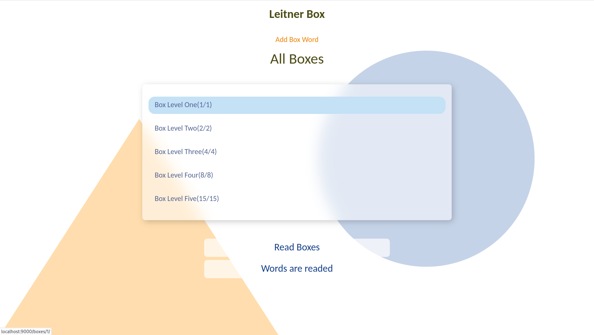
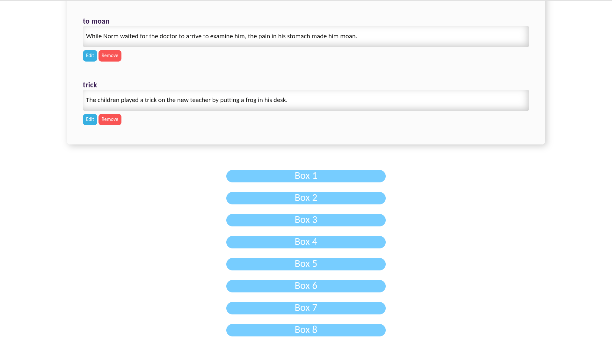
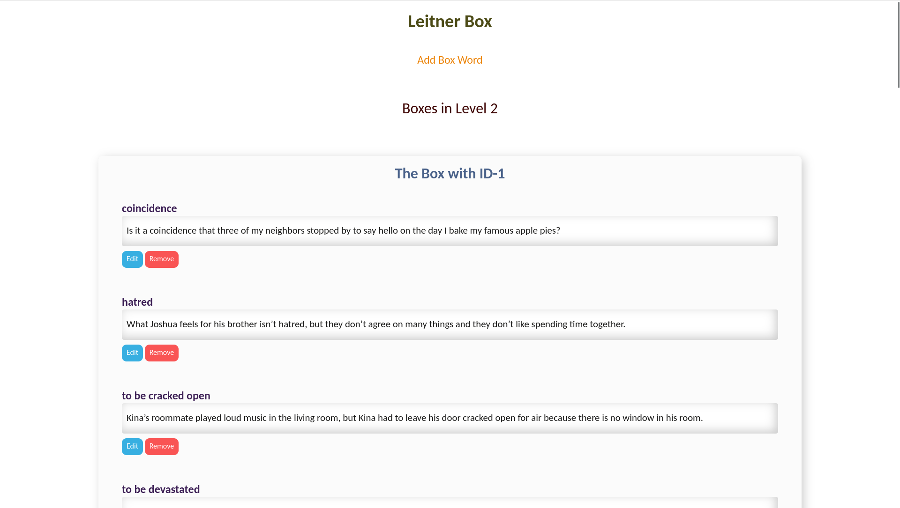
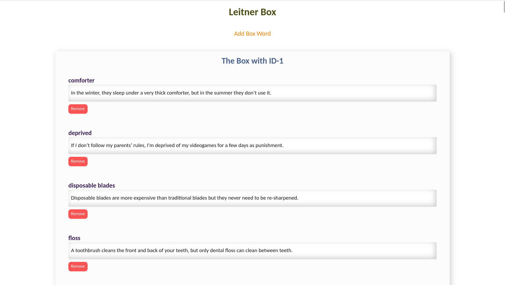
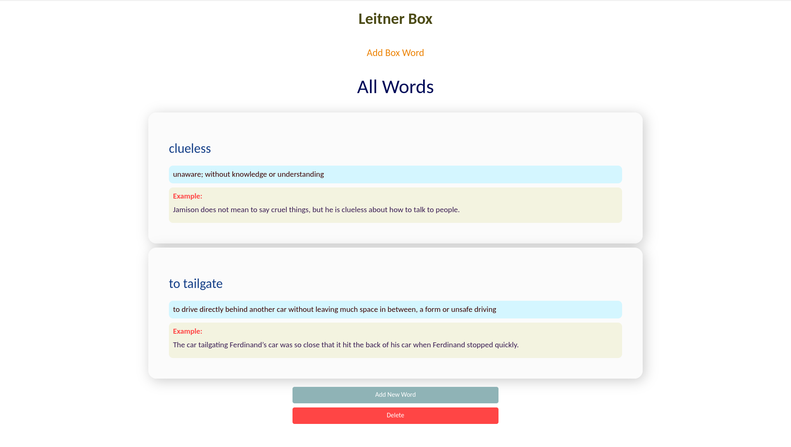
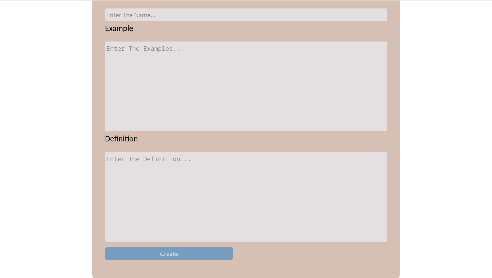

# 📦 Leitner Box

[](https://www.djangoproject.com/)
[](https://www.python.org/)
[](LICENSE)

A Leitner Box designed for anyone who wants to save vocabulary and learn consistently every day.

## 🖌️ Imgaes








## 🎨 Features

- Add Boxes
- Add Wrods in Box
- Shift Boxes
- Save Readed Boxes

## ✅ Prerequisites

Before you begin, ensure you have met the following requirements:
- Python 3.12.2+
- Django 5.2+

## 🛠 Installation

### Local Development Setup

1. Clone the repository:
   ```bash
   git clone git@github.com:xadla/Leitner-Box.git
   cd Leitner-Box
   ```
2. Create and activate a virtual environment:
   ```bash
   python -m venv venv
   source venv/bin/activate
   `venv\Scripts\activate` # On Windows use
   ```
3. Install dependencies:
   ```bash
   pip install -r requirements.txt
    ```
4. Run migrations:
   ```bash
   python manage.py migrate
   ```
5. Create a superuser (optional):
   ```bash
   python manage.py createsuperuser
   ```
6. Run the development server:
   ```bash
   python manage.py runserver
   ```
### Running the Project with Docker

To build and run the Django application using Docker:

1. Build the Docker Image
    ```bash
    docker build -t leitner .
    ```
2. Run the Docker Container
    ```bash
    docker run -d \
    --name leitner-box \
    -p 9000:9000 \
    --restart unless-stopped \
    leitner
   ```
- The app will be available at: http://localhost:9000

- The container will automatically restart unless stopped manually.

## 📁 Project Structure
```bash
Leitner-Box/
├── boxes
│   ├── admin.py
│   ├── apps.py
│   ├── forms.py
│   ├── __init__.py
│   ├── migrations
│   ├── models.py
│   ├── static
│   ├── templates
│   ├── tests.py
│   ├── urls.py
│   └── views.py
├── Dockerfile
├── Leitner
│   ├── asgi.py
│   ├── __init__.py
│   ├── settings.py
│   ├── urls.py
│   └── wsgi.py
├── manage.py
├── pages
│   ├── admin.py
│   ├── apps.py
│   ├── __init__.py
│   ├── migrations
│   ├── models.py
│   ├── static
│   ├── templates
│   ├── tests.py
│   ├── urls.py
│   └── views.py
├── README.md
├── requirements.txt
├── static
│   ├── base.css
│   └── inc
└── templates
    ├── base.html
    └── inc
```
## 🙌 Credits
Made with ❤️ by xadla

## 📜 License

This project is licensed under the MIT License - see the LICENSE file for details.